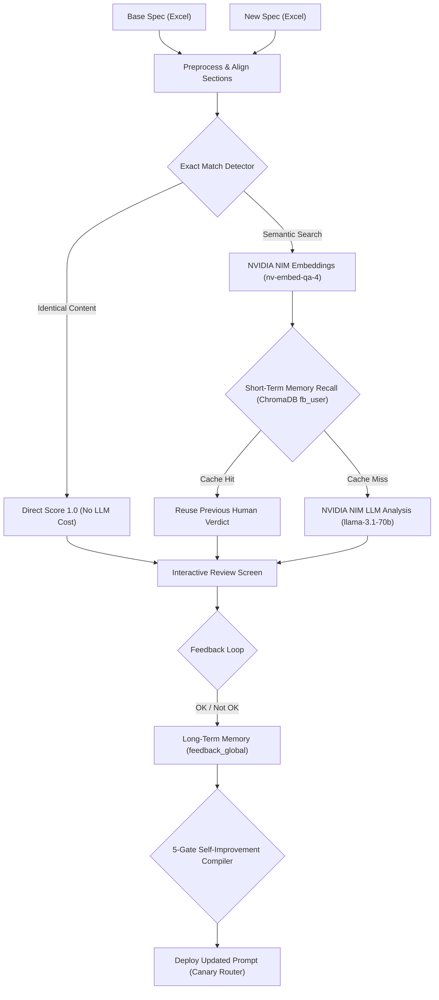

# 🔍 AI Requirement Similarity Assistant (AIS Assist)

[](https://www.python.org/)
[](https://streamlit.io/)
[](https://www.trychroma.com/)
[](https://build.nvidia.com/)
[](#)

An intelligent, production-ready requirements comparison and compliance engineering workbench. It automates compliance reviews between incoming customer specifications and legacy engineering documents. By integrating **ChromaDB** collections, **NVIDIA NIM** endpoints, and a **Dual-Layer Memory & Self-Improvement Loop**, it maximizes matching accuracy while reducing API token consumption by up to 60%.

---

## 🏗️ System Architecture & Processing Pipeline



---

## 🚀 Key Features

* **Multi-Layer Token Saver**:
  1. **Exact String Match**: Bypasses embeddings and LLM calls entirely for matching rows, saving 40%+ compute.
  2. **Short-Term Memory**: Checks current pairs against previous human-validated reviews in ChromaDB (using cosine similarity $\geq 0.97$) to reuse verdicts.
  3. **Local Result Cache**: Thread-safe caching on disk with SHA-256 session keys.
* **5-Gate Self-Improvement Compiler**:
  - *Gate 1*: Aggregates error reports anonymously (Not OK verdicts).
  - *Gate 2*: LLM dynamically designs prompt updates based on error patterns.
  - *Gate 3*: Shadow validates updated prompts against historical test suites.
  - *Gate 4*: Administrator reviews the proposed prompt changes.
  - *Gate 5*: Canary deploys the new prompt version to a subset (10%) of active sessions.
* **Interactive UI**: Custom tables with inline diff markers and review logs.

---

## 📁 Repository Structure

```text
sentence-similarity-tool/
├── am_ais_assist/          # Core backend package
│   ├── cache_manager.py    # Per-user isolated cache handlers
│   ├── config.py           # NVIDIA NIM and ChromaDB configurations
│   ├── core.py             # ChromaDB client and similarity metrics
│   ├── feedback_store.py   # Short-term and long-term memory operations
│   ├── llm_service.py      # OpenAI client setup for NVIDIA NIM endpoints
│   ├── pipeline.py         # Main execution coordinator
│   ├── postprocess.py      # Excel generation and difference highlighting
│   ├── preprocess.py       # Excel parser and section strategies
│   ├── progress_manager.py # Multi-user thread-safe progress callbacks
│   ├── prompt_registry.py  # Prompt version storage and canary metadata
│   ├── self_improve.py     # 5-Gate self-improving prompt compiler
│   └── utils.py            # Embedding visualizers and helper functions
├── prompts/
│   └── image_prompt_sentence_similarity.md  # ChatGPT design prompts
├── app.py                  # Streamlit entry point
├── Dockerfile              # Deployment configuration
├── requirements.txt        # Package dependencies
└── skills.md               # Antigravity skill definitions
```

---

## 🛠️ Setup & Execution

### 1. Configure the Environment
Create a `.env` file at the root of the project:
```env
NVIDIA_API_KEY="nvapi-..."
NVIDIA_BASE_URL="https://integrate.api.nvidia.com/v1"
```

### 2. Install Dependencies
```bash
pip install -r requirements.txt
```

### 3. Launch the Streamlit Workbench
```bash
streamlit run app.py
```

---

## 🛡️ Corporate Confidentiality Notice
This repository is an anonymized, public proof-of-concept (`[Public POC]`) demonstrating the semantic matching and memory pipeline architectures. It does not contain proprietary data or internal intellectual property from Bosch or ZF Rane.
