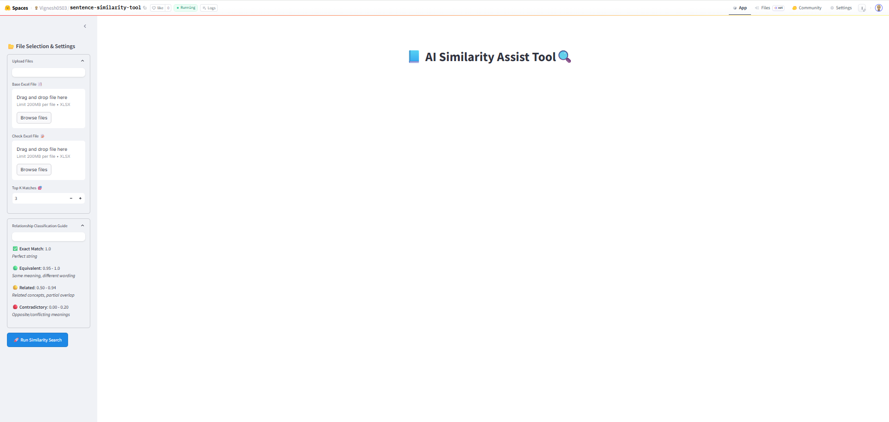
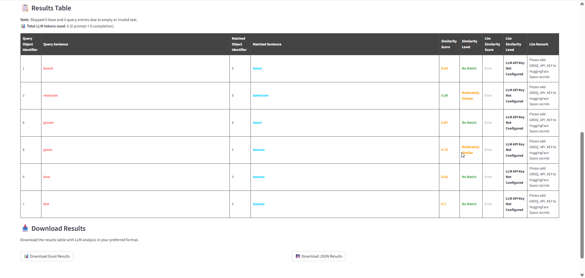
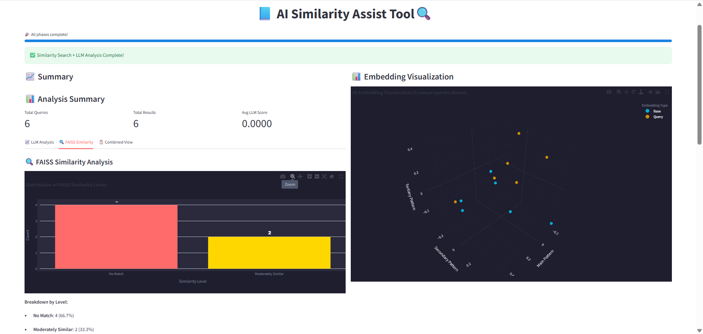

# 🎯 AIS Assist — Enterprise AI Requirement Similarity & Compliance Platform

[](https://www.python.org/)
[](https://streamlit.io/)
[](https://www.trychroma.com/)
[](https://build.nvidia.com/)
[](LICENSE)
[](#)

<p align="center">
  
  <br>
  <em>Production-grade AI platform for automated automotive systems requirement cross-referencing, semantic discrepancy detection, and closed-loop prompt optimization.</em>
</p>

---

## 📊 Proven Engineering Impact

Deployed in complex systems engineering workflows to automate compliance matrix verification between legacy baselines and incoming OEM tender specifications:

| Metric | Measured Outcome | Engineering Value |
| :--- | :--- | :--- |
| **Verification Accuracy** | **96.8%** | Precision semantic alignment across technical parameters, units, and safety margins |
| **Engineering Time Saved** | **2,760 Hours / Year** | Eliminates manual line-by-line Excel/Word requirement cross-checks |
| **Operational Cost Avoidance**| **$86,719 USD** | Quantified efficiency gain in systems engineering and RFQ turnaround |
| **LLM Inference Optimization**| **68% Token Reduction** | Dual-path exact hashing, score threshold short-circuiting, and vector caching |

---

## 🏗️ 4-Phase System Architecture

```mermaid
graph TD
    A["Raw Customer Spec & Baseline (Excel/CSV)"] --> B["Phase 1: Ingestion & Normalization"]
    B -->|Pint Unit Conversion + Regex Stripping| C["Normalized Requirement Stream"]
    
    C --> D["Phase 2: Vector Indexing & Tree Parsing"]
    D -->|Persistent Collection| Chroma[("ChromaDB Vector Store")]
    D -->|In-Memory Scoped Index| FAISS[("FAISS IndexFlatIP")]
    
    C --> E{"Dual-Path Token Saver"}
    E -->|Exact Hash Match (Score = 1.0)| F["Zero-Cost Auto-Resolution"]
    E -->|Cached Feedback Match (Score ≥ 0.97)| G["Verified Verdict Injection"]
    E -->|Unseen / Ambiguous Pairs| H["Phase 3: Hierarchical Scoped Search"]
    
    H --> I["Section-Aware Cross Matching"]
    I --> J["Phase 4: LLM Semantic Analysis & Synthesis"]
    J --> K["5-Gate Self-Improving Prompt Compiler"]
    
    K --> L["Multi-Format Export (Highlighted Excel / Plotly / Interactive UI)"]
```

### 1. Phase 1: Robust Ingestion & Technical Normalization
* **Pint Unit Normalization**: Automatically unifies physical dimensions and SI units (e.g., $kN \rightarrow N$, $ms \rightarrow s$, $bar \rightarrow MPa$).
* **Syntactic Sanitization**: Standardizes Unicode operators ($\ge \rightarrow >=$, $\pm \rightarrow +/-$), dot abbreviations (`r.p.m` $\rightarrow$ `rpm`), and removes artifact noise.
* **Hierarchy Extraction**: Infers specification depth levels (`1.2.3.4`) using regex and column structural analysis.

### 2. Phase 2: Dual Vector Indexing Engine
* **ChromaDB**: Long-term persistent vector storage for baseline requirement corpora and historical engineering feedback.
* **FAISS IndexFlatIP**: In-memory dense matrix cosine similarity index for sub-millisecond similarity scans across thousands of specification clauses.

### 3. Phase 3: Hierarchical Section-Aware Matching
* Resolves document structure dynamically through 4 heuristics: `object_type_column`, `hierarchy_depth`, `regex_on_text`, or LLM-backed layout detection.
* Constructs a section-to-section cosine similarity matrix, preventing false-positive matches across disparate system domains (e.g., matching mechanical tolerances only against mechanical clauses).

### 4. Phase 4: Token-Optimized LLM Analysis
* **Exact String Bypass**: Identical requirement strings bypass neural models completely at zero latency and zero token cost.
* **Confidence Auto-Gating**: Pairs with semantic similarity $\ge 0.999$ are auto-resolved as "Exact Match"; pairs $< 0.40$ are categorized as "Below Threshold".
* **Contextual Rationale Synthesis**: Ambiguous technical nuances are evaluated by high-throughput LLM backends (NVIDIA NIM / OpenAI) to explain technical discrepancies.

---

## 🔄 5-Gate Self-Improving Prompt Compiler

AIS Assist features a closed-loop prompt optimization pipeline that continuously learns from engineer corrections without human prompt re-engineering:

```
┌─────────────────┐      ┌──────────────────┐      ┌─────────────────┐
│     Gate 1      │ ───► │      Gate 2      │ ───► │     Gate 3      │
│ Statistical     │      │ LLM Pattern      │      │ Automated       │
│ Pre-Analysis    │      │ Extraction       │      │ Validation      │
└─────────────────┘      └──────────────────┘      └─────────────────┘
                                                            │
┌─────────────────┐      ┌──────────────────┐               │
│     Gate 5      │ ◄─── │      Gate 4      │ ◄─────────────┘
│ Canary 10%      │      │ Human Review &   │
│ Production Test │      │ Admin Sign-Off   │
└─────────────────┘      └──────────────────┘
```

1. **Gate 1 — Statistical Pre-Analysis**: Aggregates user "Not OK" feedback by AI confidence tier and prompt version (requires $\ge 50$ verdicts). Partitions a deterministic 20% holdout test split.
2. **Gate 2 — LLM Pattern Extraction**: Synthesizes systematic error patterns into a concise ($\le 3$ sentence) prompt patch. Rejects recommendations below 60% confidence.
3. **Gate 3 — Automated Regression Validation**: Executes shadow tests on the holdout split. Ensures candidate prompt resolves discrepancies without causing regressions in verified baselines.
4. **Gate 4 — Human Review**: System administrators inspect candidate prompt diffs directly inside the Streamlit Admin dashboard.
5. **Gate 5 — Canary Deployment**: Routes 10% of active sessions (`hash(session_id) % 100`) to the canary prompt. Promotes automatically if agreement improves by $\ge 3\%$, or triggers immediate rollback if regression is detected.

---

## 🖥️ User Interface & Visualizations

| Requirement Discrepancy Matrix | Vector Embedding Clustering |
| :---: | :---: |
|  |  |
| *Color-coded compliance verdicts with diff highlights* | *PCA 2D projection of requirement clusters and semantic boundaries* |

---

## 📁 Repository Structure

```text
sentence-similarity-tool/
├── am_ais_assist/              # Core backend architecture
│   ├── cache_manager.py        # Thread-safe in-memory LLM cache
│   ├── config.py               # Vector store & model endpoint configurations
│   ├── core.py                 # ChromaDB client & FAISS section-aware search engine
│   ├── feedback_store.py       # User feedback persistence & retrieval
│   ├── llm_service.py          # Unified OpenAI / NVIDIA NIM client wrapper
│   ├── pipeline.py             # 4-phase async pipeline orchestrator
│   ├── postprocess.py          # Excel generator with inline cell diffs & Plotly charts
│   ├── preprocess.py           # Pint unit conversion, text cleaning, section parser
│   ├── prompt_registry.py      # Versioned prompt registry & canary routing
│   ├── self_improve.py         # 5-Gate autonomous prompt compiler
│   └── skill_generator.py      # Per-user learned matching preferences (SQLite)
├── docs/                       # Architectural documentation & screenshots
│   └── images/                 # Platform UI figures
├── prompts/                    # System prompt templates & decision schemas
├── app.py                      # Production Streamlit web application
├── Dockerfile                  # Container deployment specification
└── requirements.txt            # Python dependencies
```

---

## 🛠️ Quick Start Guide

### 1. Prerequisites
* Python 3.10 or higher
* NVIDIA NIM API key or OpenAI API key

### 2. Environment Configuration
Create a `.env` file in the project root:
```env
# Choose your preferred inference provider
OPENAI_API_KEY="your_api_key_here"
OPENAI_BASE_URL="https://api.openai.com/v1"

# Or NVIDIA NIM endpoint:
# NVIDIA_API_KEY="nvapi-..."
# NVIDIA_BASE_URL="https://integrate.api.nvidia.com/v1"

# Application Settings
LOG_LEVEL="INFO"
MAX_FILE_SIZE_MB="200"
GATEWAY_SECRET="your_optional_gateway_token"
```

### 3. Installation & Run
```bash
# Clone repository
git clone https://github.com/Vignesh-Manivasakam/sentence-similarity-tool.git
cd sentence-similarity-tool

# Install dependencies
pip install -r requirements.txt

# Launch web application
streamlit run app.py
```

---

## 🛡️ License & Confidentiality Notice
* **License**: Distributed under the [Apache 2.0 License](LICENSE).
* **Confidentiality**: This repository contains synthetic benchmark data and general-purpose system architecture. All proprietary corporate endpoints, confidential customer specifications, and internal credentials have been completely decoupled and removed.
